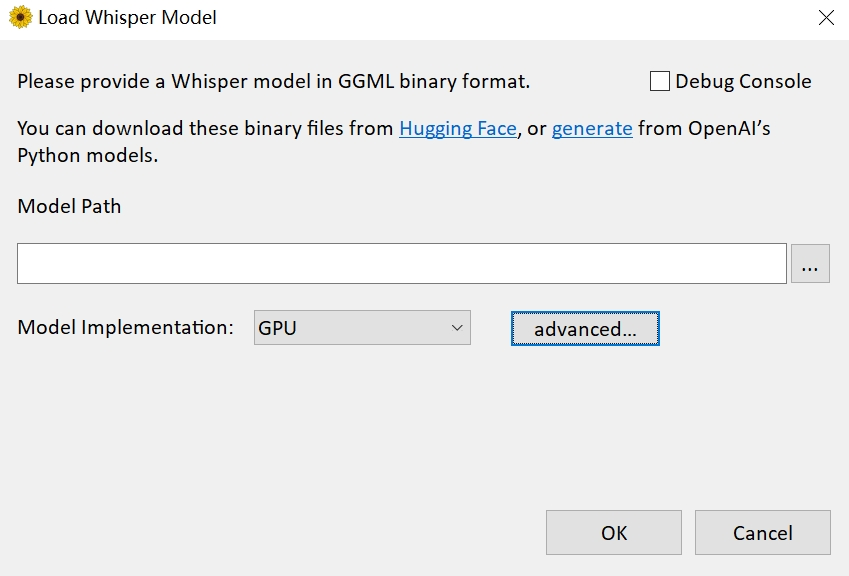
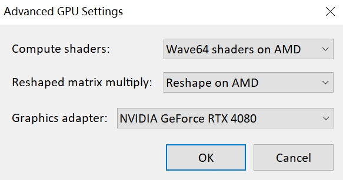

本篇文章来分享一下如何提取音视频中的文本。

**第一步：**

打开 https://github.com/Const-me/Whisper/releases/tag/1.8.1 点击下载 WhisperDesktop.zip，解压之后会得到一个 exe 文件和一个 dll 文件。我们点击 WhisperDesktop.txt，界面如下。

Model Path 表示模型的路径，如果想实现文本提取，那么需要有专门的模型。然后是 Model Implemention，直接选择默认的 GPU 即可，所以如果你有一个好的 GPU，那么训练速度会更快。

接着是 advanced，即高级选项，我们点击它。

里面的 Graphics adapter，选择你的显卡，我这里的 RTX 4080。

**第二步：**

下载模型，打开链接 https://huggingface.co/ggerganov/whisper.cpp/tree/main 下载指定的模型。

里面的模型种类非常多，模型越大，那么识别的准确率就越高，但是需要显存就越大，我这里就下载最大的版本，ggml-large-v1.bin。如果你觉得下载速度很慢，那么也可以访问国内的 [huggingface 镜像](https://hf-mirror.com/ggerganov/whisper.cpp/tree/main)。

----

模型下载完成之后，我们在 WhisperDesktop 的 Model Path 中指定模型，然后点击 ok。

界面会变成上面这样，其中 Language 表示视频或音频中文本对应的语言，比如一个视频是中文的，那么就选择 Chinese。然后 Transcribe File 表示要解析的视频或音频文件，Output Format 表示解析出的文本格式，支持纯文本、文本（带时间线）、SRT（用于打轴），最后再设置输出路径即可。

以上都设置完成后，我们点击 Transcribe，结果如下。

此时正在提取文本中，整个过程需要大概十来秒。完成之后点击生成的文本，会发现内容还是很准确的。

## 什么是线性回归

**和之前介绍的K近邻算法不同，K近邻主要是解决分类问题，而线性回归顾名思义是用来解决回归问题的。而线性回归具有如下特征：**

+ `解决回归问题`
+ `思想简单，实现容易`
+ `许多强大的非线性模型的基础，比如逻辑回归、多项式回归、svm等等`
+ `结果具有很好的可解释性`
+ `蕴含机器学习中的很多重要思想`

**那么什么是线性回归呢？我们画一张图：**

**图中是房屋的面积与价格之间的对应关系，不同的面积对应不同的价格，由此在二维平面中便形成了多个点。我们的目的就是要找到一条直线，最大程度上来拟合这些点。**

**但是在之前的K近邻中，横轴和纵轴都是样本的特征，而标签则是由这个点是红色还是蓝色决定的。但是在线性回归中，由于是房产数据，我们必须要预测出一个具体的数值，而不能像分类问题那样，用简单的颜色来代表类别。而这些数据显然是在一个连续的样本空间中，因此需要一个坐标轴来表示。也正因为如此，在二维平面中只能有一个特征，要是多个特征，我们就要在更高的维度上进行观察了。**

**如果样本的特征只有一个，我们称之为简单线性回归。**

**我们的目的是要找到一个直线来尽可能多的拟合这些点，而在二维平面上显然是 $y = ax + b$ ，那么对于每一个样本 $x$，都会有一个真实值 ${y}$ 和使用拟合曲线预测出来的预测值 $\hat {y}$ ，因此我们的真实值和预测值就会有一个差距。而 $y = ax + b$ 可以对应平面中的任何曲线，我们的目的显然是找到真实值和预测值之间的差距能达到最小的那根曲线。**

> **因此如果使用数学来描述的话就是：对于每一个样本点 $x^{i}$ ，都有一个真实值 $y^{i}$ ，和一个预测值 $\hat {y}^{i} = ax^{i} + b$ ，而我们希望 $y^{i}$ 和 $\hat y^{i}$ 之间的差距尽量小。如果考虑所有样本的话，那么就是所有样本的预测值和真实值之差的平方和 $\displaystyle\sum^{m}_{i=1}(y^{i} - {\hat y^{i}})^{2}$ 最小。**

**既然有真实值和预测值，那么评价一个直线的拟合程度，就看所有样本的真实值和预测值之差。但是显然我们不能直接将两者之差加在一起，那么两者之差可能有正有负，会抵消掉；若是取绝对值的话，那么我们知道，这不是一个处处可导的函数，因为我们后面在求系数和截距的时候，是需要函数处处可导的。那么显然容易想到取两者之差的平方，而且也将正负的问题解决了，然后再将m个样本进行相加即可。**

> **因此我们最终的目的就是找到一个合适的 $a$ 和 $b$ ，使得 $\displaystyle\sum^{m}_{i=1}(y^{i} - ax^{i} - b)^{2}$ 达到最小，然后通过 $a$ 和 $b$ 来确定我们的拟合曲线。**

**我们可以对式子进行化简，但是我们先不着急这么做，我们可以先看看机器学习的思路。**

> **我们的目标是找到 $a$ 和 $b$ ，使得 $\displaystyle\sum^{m}_{i=1}(y^{i} - ax^{i} - b)^{2}$ 达到最小，而 $\displaystyle\sum^{m}_{i=1}(y^{i} - ax^{i} - b)^{2}$ 便被称为"损失函数(loss function)"，与之相对的还有一个"效用函数(utility function)"。**
>
> **近乎所有的参数学习算法，都是这个模式。得出一个损失函数或者一个效用函数，两者统称为目标函数。通过不断地优化，使得损失函数的值达到最小，或者效用函数的值达到最大。这不是特定的某个算法，而是近乎所有的参数学习都是这个套路，比如：线性回归、多项式回归、逻辑回归、SVM、神经网络等等。本质上，都是在学习参数，来最优化目标函数。只不过由于模型的不同，因此建立的参数、优化的方式也不同。**
>
> **也正因为机器学习的大部分算法都拥有这个特征，于是有了一门学科，叫最优化原理。**

**回到我们的问题，那么我们如何才能求出 $a$ 和 $b$ 呢？显然要通过求导的方式，如果你还记得高中学习过的数学知识，那么你会发现这不就是最小二乘法嘛。下面我们就来推导一下，当然啦，如果不感兴趣可以只看结论，但是最好还是要掌握一下推导过程，对自身是有帮助的。**

> **我们将 $\displaystyle\sum^{m}_{i=1}(y^{i} - ax^{i} - b)^{2}$ 记作为 $F$，那么有 $F = \displaystyle\sum^{m}_{i=1}(y^{i} - ax^{i} - b)^{2}$ ，而我们的目的显然是对 $a$ 和 $b$ 求偏导。**
>
> **我们先对 $b$ 求偏导，过程如下：**
>
> **$\frac{\delta F}{\delta b} = \displaystyle\sum^{m}_{i=1}2(y^{i} - ax^{i} - b) * -1$**
>
> **$\frac{\delta F}{\delta b} = -2\displaystyle\sum^{m}_{i=1}(y^{i} - ax^{i} - b)$**
>
> **$\frac{\delta F}{\delta b} = -2(\displaystyle\sum^{m}_{i=1}y^{i} - a\displaystyle\sum^{m}_{i=1}x^{i} - \displaystyle\sum^{m}_{i=1}b)$**
>
> **$\frac{\delta F}{\delta b} = -2(m\overline{y} - am\overline{x} - mb)$**
>
> **我们下面再对 $a$ 求偏导，过程如下：**
>
> **$\frac{\delta F}{\delta a} = \displaystyle\sum^{m}_{i=1}2(y^{i} - ax^{i} - b) * -x^{i}$**
>
> **$\frac{\delta F}{\delta a} = -2\displaystyle\sum^{m}_{i=1}(x^{i}y^{i} - a(x^{i} )^{2}- bx^{i})$**
>
> **$\frac{\delta F}{\delta a} = -2(\displaystyle\sum^{m}_{i=1}x^{i}y^{i} - a\displaystyle\sum^{m}_{i=1}(x^{i})^{2} - b\displaystyle\sum^{m}_{i=1}x^{i})$**
>
> **然后令** $\frac{\delta F}{\delta b} = -2(m\overline{y} - am\overline{x} - mb) = 0$**，得到** $\overline{y} - a\overline{x} - b = 0$**，解得** $b = \overline{y} - a\overline{x}$
>
> **此时 $b$ 我们就求了出来，然后再令** $\frac{\delta F}{\delta a} = -2(\displaystyle\sum^{m}_{i=1}x^{i}y^{i} - a\displaystyle\sum^{m}_{i=1}(x^{i})^{2} - b\displaystyle\sum^{m}_{i=1}x^{i}) = 0$**，得到** $\displaystyle\sum^{m}_{i=1}x^{i}y^{i} - a\displaystyle\sum^{m}_{i=1}(x^{i})^{2} - mb\overline x = 0$
>
> **然后将** $b = \overline y - a\overline x$ **带进去，得到** $\displaystyle\sum^{m}_{i=1}x^{i}y^{i} - a\displaystyle\sum^{m}_{i=1}(x^{i})^{2} - (\overline y - a\overline x)m\overline x = 0$
>
>  $\displaystyle\sum^{m}_{i=1}x^{i}y^{i} - a\displaystyle\sum^{m}_{i=1}(x^{i})^{2} - m\overline x\overline y + am\overline x^{2} = 0$
>
>  $\displaystyle\sum^{m}_{i=1}x^{i}y^{i} - m\overline x\overline y = a(\displaystyle\sum_{i=1}^{m}(x^{i})^{2} - m\overline x^{2})$
>
>  $a = \frac{\displaystyle\sum^{m}_{i=1}x^{i}y^{i} - m\overline x\overline y}{\displaystyle\sum_{i=1}^{m}(x^{i})^{2} - m\overline x^{2}}$
>
> **又因为** $\displaystyle\sum^{m}_{i=1}(x_{i} - \overline x)(y_{i} - \overline y) = \displaystyle\sum^{m}_{i=1}(x_{i}y_{i} - x_{i}\overline y - \overline {x}y_{i} + \overline x\overline y) = \displaystyle\sum^{m}_{i=1}x^{i}y^{i} - m\overline x\overline y - m\overline x\overline y + m\overline x\overline y = \displaystyle\sum^{m}_{i=1}x^{i}y^{i} - m\overline x\overline y$
>
> **又因为** $\displaystyle\sum_{i=1}^{m}(x^{i} - \overline x)^{2} = \displaystyle\sum_{i=1}^{m}((x^{i})^{2} - 2\overline xx^{i} + \overline x^{2}) = \displaystyle\sum_{i=1}^{m}(x^{i})^{2} - 2m\overline x^2 + m\overline x^{2} = \displaystyle\sum_{i=1}^{m}(x^{i})^{2} - m\overline x^{2}$
>
> **所以** $a = \frac{\displaystyle\sum^{m}_{i=1}(x_{i} - \overline x)(y_{i} - \overline y)} {\displaystyle\sum_{i=1}^{m}(x^{i} - \overline x)^{2}}$
>
> **到此，我们便找到了最理想的 $a$ 和 $b$ ，其中** $a = \frac{\displaystyle\sum^{m}_{i=1}(x_{i} - \overline x)(y_{i} - \overline y)} {\displaystyle\sum_{i=1}^{m}(x^{i} - \overline x)^{2}}$**，** $b = \overline{y} - a\overline{x}$

**整个过程还是比较简单的，如果你的数学基础还没有忘记的话，主要是最后的那两步替换比较巧妙。**

**当然这个式子也不用刻意去记，网上一大堆，需要的时候去查找就是了，重要的是理解整个推导过程。**

> **我们上面推导的是简单线性回归，也就是要求样本只有一个特征，但是显然真实的样本，特征肯定不止一个。如果预测的样本有多个特征的话，那么便称之为多元线性回归，我们后面会介绍。**

## 简单线性回归的实现

**下面我们就使用代码来实现简单线性回归，先来看一下简单的数据集。**

~~~Python
import numpy as np
import plotly.graph_objs as go

x = np.array([1, 2, 3, 4, 5])
y = np.array([1, 3, 2, 3, 5])

trace0 = go.Scatter(x=x, y=y, mode="markers", marker={"size": 10})
figure = go.Figure(data=[trace0], layout={"showlegend": False, "template": "plotly_dark"})
figure.show()
~~~

**可以看到数据绘制出来，大致长上面这样，下面就来按照公式推导我们的 $a$ 和 $b$ 。**

~~~Python
a = np.sum( (x - np.mean(x)) * (y - np.mean(y)) ) / np.sum( (x - np.mean(x)) ** 2 )
b = np.mean(y) - a * np.mean(x)
print(a, b)  # 0.8 0.39999999999999947
~~~

**此时 $a$ 和 $b$ 便被计算了出来，那么我们就将这条直线给绘制出来吧。**

~~~Python
y_hat = a * x + b

trace0 = go.Scatter(x=x, y=y, mode="markers", marker={"size": 10})
trace1 = go.Scatter(x=x, y=y_hat, mode="lines", marker={"size": 10})
figure = go.Figure(data=[trace0, trace1], layout={"showlegend": False, "template": "plotly_dark"})
figure.show()
~~~

**然后我们进行预测。**

~~~~Python
x_predict = 6
y_predict = a * x_predict + b
print(y_predict)  # 5.2
~~~~

**肿么样，似不似灰常简单呢？那么下面我们就按照sklearn的模式，来封装这个简单线性回归算法。**

~~~Python
import numpy as np

class SimpleLinearRegression:

    def __init__(self):
        """
        关于变量后面加上一个下划线这种命名方式在sklearn中是有约定的
        表示这种变量不是由用户传来的，而是一开始就有的，具体是什么值则是由用户传来的样本进行训练之后得到的
        并且还可以提供给用户使用，这种类型的变量都会在后面加上一个下划线
        """
        self.a_ = None
        self.b_ = None

    def fit(self, x_train: np.ndarray, y_train: np.ndarray):
        """通过x_train和y_train训练模型"""
        assert x_train.ndim == 1, "简单线性回归只支持一个具有一个特征的训练集"
        assert len(x_train) == len(y_train), "样本数必须和标签数保持一致"

        x_mean = np.mean(x_train)
        y_mean = np.mean(y_train)
        self.a_ = np.sum((x_train - x_mean) * (y_train - y_mean)) / np.sum((x_train - x_mean) ** 2)
        self.b_ = y_mean - self.a_ * x_mean

        # 按照sklearn的标准，我们要将这个实例进行返回
        return self

    def predict(self, x_predict):
        """对传来的x进行预测"""
        assert self.a_ is not None, "预测(predict)之前要先拟合(fit)"
        if isinstance(x_predict, list):
            x_predict = np.array(x_predict)
        return self.a_ * x_predict + self.b_

    def __str__(self):
        return f"<SimpleLinearRegression>:a_={self.a_},b_={self.b_}"

    def __repr__(self):
        return f"<SimpleLinearRegression>:a_={self.a_},b_={self.b_}"

x = np.array([1, 2, 3, 4, 5])
y = np.array([1, 3, 2, 3, 5])
sim_linear_reg = SimpleLinearRegression()
sim_linear_reg.fit(x, y)
print(sim_linear_reg.a_)  # 0.8
print(sim_linear_reg.b_)  # 0.39999999999999947

x_predict = [1, 3, 4, 6]
print(sim_linear_reg.predict(x_predict))  # [1.2 2.8 3.6 5.2]
~~~

**可以看到，计算的结果是一致的。此时我们便通过sklearn的方式实现了一个简单线性回归**

## 衡量线性回归的指标

**在knn中，我们将数据集分为训练集合测试集，训练集用于训练模型，然后对测试集进行预测，通过预测出来的标签和真实标签进行对比，得到一个分类的准确度。**

**但是对于回归算法来说，我们如何评价一个算法呢？其实对于回归算法来说，我们仍然需要将数据集分为训练集和测试集，而我们的目的就是找到一个a和b，使得在训练集中，预测值和真实值之间差距尽可能的小。**

**所以我们的目标就变成了，找到 $a$ 和 $b$ ，使得 $\displaystyle\sum^{m}_{i=1}(y^{i}_{train} - ax^{i}_{train} - b)^{2}$ 尽可能的小；然后对预测集进行预测，得到的误差 $\displaystyle\sum^{m}_{i=1}(y^{i}_{test} - ax^{i}_{test} - b)^{2}$ 便是我们的评价指标，越小代表模型越好。**

-------

**但是这样又出现了一个问题，那就是我们的预测结果是和样本个数m有关的。如果A预测10000个样本，误差是1000，而B预测10个样本误差就达到800了，难道说B的算法比A好吗？显然是不能的，那么我们可以改进一下。**

**那么下面就产生了三个指标：**

**1. 均方误差(Mean Squared Error，MSE)**

> **$\frac{1}{m} \displaystyle\sum_{i=1}^{m}(y_{test}^{i} - \hat y_{test}^{i})^{2}$**

**让衡量标准与我们的样本数无关，这便是均方误差。但是呢？这个均方误差还有一个潜在的问题，那就是如果我们预测房产数据单位是万元，那么得到的单位就是万元的平方，会造成量纲上的问题。 由此产生了下面一个衡量标准**

**2. 均方根误差(Root Mean Squared Error，RMSE)**

> **$\sqrt{\frac{1}{m} \displaystyle\sum_{i=1}^{m}(y_{test}^{i} - \hat y_{test}^{i})^{2}} = \sqrt{MSE_{test}}$**

**可以看到，我们直接对均方误差进行开根，便得到了均方根误差，这样就避免了量纲的问题。其实这两个衡量标准本质上比较类似，因为均方误差大，那么均方根误差也会跟着大，只是均方根误差更具有统计学上的意义**

**3. 平均绝对误差(Mean Absolute Error，MAE)**

> **$\frac{1}{m} \displaystyle\sum_{i=1}^{m}|y_{test}^{i} - \hat y_{test}^{i}|$**

**这个衡量标准非常的直白，就是每一个样本的真实值和预测值之差的绝对值之和，这便是平均绝对误差。之前我们说过，在训练的时候，不建议使用这个模型，因为这不是一个处处可导的函数，但是在预测的时候，我们是完全可以使用这个指标的。也就是说，我们在评价一个算法所使用的指标和训练模型所使用的目标函数是可以不一致的。**

### 使用程序来实现三个指标

**这次我们使用sklearn中的真实数据集，波士顿房产数据。但由于我们这里还是简单线性回归，而波士顿房产数据有多个特征，因此我们这里只选择一个特征，选择房子的房间数。**

~~~Python
from sklearn.datasets import load_boston

boston = load_boston()
x = boston.data[:, 5]  # 选择房屋的房间数
y = boston.target
trace0 = go.Scatter(x=x, y=y, mode="markers", marker={"size": 10})
figure = go.Figure(data=[trace0], layout={"showlegend": False, "template": "plotly_dark"})
figure.show()
~~~

**数据集大致长这样，但是会发现有些奇怪的点，对，就是纵轴为50的位置。之所以出现这种情况，是因为在实际生活中，没有进行更仔细的分类，比如价格超过50万美元，就按照50万美元来统计了。比如我们经常看到的统计月薪，最下面的选项是2000及以下，最上面的是40000及以上等等。 因此我们可以将最大值给去掉：**

~~~Python
x = boston.data[:, 5] 
y = boston.target
x = x[y < np.max(y)]
y = y[y < np.max(y)]

trace0 = go.Scatter(x=x, y=y, mode="markers", marker={"size": 10})
figure = go.Figure(data=[trace0], layout={"showlegend": False, "template": "plotly_dark"})
figure.show()
~~~

**如此一来，我们便把最大值给去掉了。**

~~~Python
from sklearn.model_selection import train_test_split

class SimpleLinearRegression:

    def __init__(self):
        self.a_ = None
        self.b_ = None

    def fit(self, x_train: np.ndarray, y_train: np.ndarray):
        assert x_train.ndim == 1, "简单线性回归只支持一个具有一个特征的训练集"
        assert len(x_train) == len(y_train), "样本数必须和标签数保持一致"

        x_mean = np.mean(x_train)
        y_mean = np.mean(y_train)
        self.a_ = np.sum((x_train - x_mean) * (y_train - y_mean)) / np.sum((x_train - x_mean) ** 2)
        self.b_ = y_mean - self.a_ * x_mean

        return self

    def predict(self, x_predict):
        assert self.a_ is not None, "预测(predict)之前要先拟合(fit)"
        if isinstance(x_predict, list):
            x_predict = np.array(x_predict)
        return self.a_ * x_predict + self.b_

    def __str__(self):
        return f"<SimpleLinearRegression>:a_={self.a_},b_={self.b_}"

    def __repr__(self):
        return f"<SimpleLinearRegression>:a_={self.a_},b_={self.b_}"

boston = load_boston()
x = boston.data[:, 5]  # 选择房屋的房间数
y = boston.target

x = x[y < np.max(y)]
y = y[y < np.max(y)]

x_train, x_test, y_train, y_test = train_test_split(x, y)
print(x_train.shape)  # (367,)
print(x_test.shape)  # (123,)

linear = SimpleLinearRegression()
linear.fit(x_train, y_train)

print(linear.a_)  # 7.920613164194192
print(linear.b_)  # -27.860720801665288
~~~

**我们将得到的直线绘制出来：**

~~~Python
trace0 = go.Scatter(x=x_train, y=y_train, mode="markers", marker={"size": 10})
trace1 = go.Scatter(x=x_train, y=linear.a_ * x_train + linear.b_, mode="lines", marker={"size": 10})
figure = go.Figure(data=[trace0, trace1], layout={"showlegend": False, "template": "plotly_dark"})
figure.show()
~~~

**然后我们使用上面的三个标准来计算它们的误差：**

~~~Python
y_predict = linear.predict(x_test)
# MSE
mse = np.sum((y_predict - y_test) ** 2) / len(y_test)
# RMSE
rmse = np.sqrt(mse)
# MAE
mae = np.sum(np.abs(y_predict - y_test)) / len(y_test)
print(mse)  # 25.9281717303928
print(rmse)  # 5.091971301018183
print(mae)  # 3.795667974965169
~~~

**可以看出还是很简单的，然后老规矩，下面肯定要看看sklearn中，这些衡量标准。首先sklearn没有RMSE，我们可以先求出MSE，再手动开根。**

~~~Python
from sklearn.metrics import mean_absolute_error
from sklearn.metrics import mean_squared_error
print(mean_absolute_error(y_test, y_predict))  # 25.9281717303928
print(np.sqrt(mean_squared_error(y_test, y_predict)))  # 5.091971301018183
print(mean_squared_error(y_test, y_predict))  # 3.795667974965169
~~~

-----

**关于RMSE和MAE，我们知道这两种衡量标准它们在量纲上是一致的，但是哪个更好呢？根据我们上面预测的结果发现RMSE大于MAE，没错，我们观察一下式子。因为RMSE进行了平方，虽然又进行了开根，但是整体来说还是有将错误放大的趋势，而MAE没有，因此我们将RMSE作为评价指标会更有意义。**

**介绍了这么多指标，你以为就完了，其实我们还有一个最好的衡量线性回归法的指标，在sklearn的线性回归中，写入score函数中的也是这个指标。**

## 最好的衡量线性回归法的指标：R Squared

**事实上，无论是RMSE还是MAE，是随着样本的不同而变化的。比如房产数据，可能预测出来的误差是五万美元，学生成绩预测出来的误差是10分，那么我们的算法是作用在房产数据好呢？还是作用在学生成绩好呢？这些是没有办法比较的。而分类问题不同，分类是根据样本的真实特征和预测特征进行比较，看看预测对了多少个，然后除以总个数，得到的准确度是在0到1之间的。越接近1越好，越接近0越差，而RMSE和MAE由于样本种类的不同，导致是无法比较的。**

**于是，我们便有了下一个指标R Squared，也就是所谓的 $R^{2}$ 。**

>  $R^{2} = 1 - \frac{\displaystyle\sum(\hat y^{i} - y^{i})^{2}}{\displaystyle\sum(\overline y^{i} - y^{i})^{2}} = \frac{使用我们的模型预测时产生的错误}{使用 y=\overline y  预测时产生的错误}$

**怎么理解这个式子呢？首先把 $y$ 的平均值看成一个模型，这个模型也叫作基准模型，分母就是用基准模型预测出来的误差。换句话说，这个结果是与样本特征是无关的，因为它没有用到 $x$ ，那么这个基准模型必然会产生很多错误。而分子则是使用我们训练出来模型进行预测出来误差，如果我们训练出来的模型预测时产生的错误除以基准模型预测时产生的错误的结果越小，那么再用1去减，得到的结果就越大，说明我们训练的模型就越好。**

**根据 $R^{2}$ 我们可以得出如下结论：**

+ **$R^{2}$ <= 1**
+ **$R^{2}$ 越大越好，当我们的模型不犯任何错误时，$R^{2}$ 取得最大值1**
+ **当我们的模型等于基准模型(Baseline Model)时，$R^{2}$ 为0**
+ **如果 $R^{2}$ < 0，说明我们学习到的模型还不如基准模型。那么很有可能我们的数据压根就不存在所谓的线性关系，不管是正相关还是负相关。**

**我们再来看看这个 $R^{2}$ ，如果我们对式子进行一下变换的话。**

>  $R^{2} = 1 - \frac{\displaystyle\sum(\hat y^{i} - y^{i})^{2}}{\displaystyle\sum(\overline y^{i} - y^{i})^{2}} =  1 - \frac{\displaystyle\sum(\hat y^{i} - y^{i})^{2} / m}{\displaystyle\sum(\overline y^{i} - y^{i})^{2} / m} = 1 - \frac{MSE(\hat y, y)}{Var(y)}$

**会发现这个 $R^{2}$ 就等于 1 - MSE/Var(y)**

**在sklearn中也提供了R Squared。**

~~~Python
from sklearn.metrics import r2_score
print(r2_score(y_test, y_predict))  # 0.5107683519296282
# 或者手动计算也可以
mse = mean_squared_error(y_test, y_predict)
r2_score = 1 - mse / np.var(y_test)
print(r2_score)  # 0.5107683519296282
~~~

**我们在K近邻中，会直接封装一个score函数，返回分类的准确度，那么在sklearn中，我们也依旧可以封装一个score。另外在sklearn的线性回归中，score函数也是直接返回了R Squared，而且sklearn的线性回归是支持多元线性回归的，后面会说。因此如果只想看分类的准确度可以调用score方法，如果想要预测出来的值，那么可以调用predict方法。**

~~~Python
import numpy as np
from sklearn.datasets import load_boston
from sklearn.model_selection import train_test_split
from sklearn.metrics import mean_squared_error

class SimpleLinearRegression:

    def __init__(self):
        self.a_ = None
        self.b_ = None

    def fit(self, x_train: np.ndarray, y_train: np.ndarray):
        assert x_train.ndim == 1, "简单线性回归只支持一个具有一个特征的训练集"
        assert len(x_train) == len(y_train), "样本数必须和标签数保持一致"

        x_mean = np.mean(x_train)
        y_mean = np.mean(y_train)
        self.a_ = np.sum((x_train - x_mean) * (y_train - y_mean)) / np.sum((x_train - x_mean) ** 2)
        self.b_ = y_mean - self.a_ * x_mean

        return self

    def predict(self, x_predict):
        assert self.a_ is not None, "预测(predict)之前要先拟合(fit)"
        if isinstance(x_predict, list):
            x_predict = np.array(x_predict)
        return self.a_ * x_predict + self.b_

    def score(self, x_test, y_test):
        y_predict = self.predict(x_test)
        mse = mean_squared_error(y_test, y_predict)
        r2_score = 1 - mse / np.var(y_test)
        return r2_score

    def __str__(self):
        return f"<SimpleLinearRegression>:a_={self.a_},b_={self.b_}"

    def __repr__(self):
        return f"<SimpleLinearRegression>:a_={self.a_},b_={self.b_}"

boston = load_boston()
x = boston.data[:, 5]  # 选择房屋的房间数
y = boston.target

x = x[y < np.max(y)]
y = y[y < np.max(y)]

x_train, x_test, y_train, y_test = train_test_split(x, y)

linear = SimpleLinearRegression()
linear.fit(x_train, y_train)

print(linear.score(x_test, y_test))  # 0.5849894775958314
~~~

## 多元线性回归和正规方程解

**我们之前一直解决的是简单线性回归，也就是我们的样本只有一个特征。但是实际中，样本是有很多很多特征的，成百上千个也是很正常的。对于有多个特征的样本，我们依旧可以使用线性回归法来解决，我们称之为多元线性回归。**

**还是以这张图为例，在简单线性回归中，我们的每一个x只是一个值。但是现在在多元线性回归中，每个x则是一个数组(或者说是向量)，具有n个特征。那么我们的方程就变成了 $y = θ_{0} + θ_{1}x_{1} + θ_{2}x_{2} + ... + θ_{n}x_{n}$ ，n个特征对应的系数则是  $θ_{0}, θ_{1}, θ_{2}, ......, θ_{n}$，而且此时仍然是有一个截距的，我们记作 $θ_{0}$ ，所以在预测模型的时候，也是有n个系数。**

**可以看到多元线性回归和简单线性回归并无本质上的不同，只不过在简单线性回归中，我们只需要求一个截距和一个系数即可，也就是 $θ_{0}$ 和 $θ_{1}$；但是在多元线性回归中，我们将只求一个截距和一个系数扩展到了求一个截距和n个系数。**

**我们在简单线性回归中，目的是使得：**$\displaystyle\sum_{i=1}^{m}(y^{i} - \hat y^{i})^{2}$ **尽可能的小，此时在多元线性回归中，我们的目的依然是使得这个式子尽可能的小，因为它表达的便是真实值和预测值之间误差。只不过此时的 $\hat y^{i} = θ_{0} + θ_{1}X_{1}^{i} + θ_{2}X_{2}^{i} + ...... + θ_{n}X_{n}^{i}$ ，其中 $x^{i} = (X_{1}^{i}, X_{2}^{i},......,X_{n}^{i})$，而我们是要找到一组 $θ_{0}, θ_{1}, θ_{2}, ......, θ_{n}$ ，来完成这一点。**

> **$\hat y^{i} = θ_{0} + θ_{1}X_{1}^{i} + θ_{2}X_{2}^{i} + ...... + θ_{n}X_{n}^{i}，θ = (θ_{0}, θ_{1}, θ_{2}, ..., θ_{n})^{T}$**
>
> **$\hat y^{i} = θ_{0}X_{0}^{i} + θ_{1}X_{1}^{i} + θ_{2}X_{2}^{i} + ...... + θ_{n}X_{n}^{i}，X_{0}^{i} ≡ 1，X^{i} = (X_{0}^{i}, X_{1}^{i}, X_{2}^{i}, ..., X_{n}^{i})$**
>
> **$\hat y^{i} = X^{i} · θ$**

**我们找到一个 $θ$，让 $θ = (θ_{0}, θ_{1}, θ_{2}, ..., θ_{n})^{T}$  ，注意这里的 $θ$ 是一个列向量，为了方便我们写成行向量的模式，然后再进行转置。但是我们发现在模型中，对于 $θ_{0}$ ，没有 $X$ 与之配对，怪孤单的，因为我们可以虚构出一个特征 $X_{0}$ ，让其与 $θ_{0}$ 结合，这样模型中的每一个部分都满足相同的规律。但是由于 $X_{0}$ 这个特征使我们虚构出来的，因此这个 $X_{0}$ 是恒等于1的。**

**我们可以对式子再进行一下推广：**

> $X_{b} = \begin{bmatrix}1 && X_{1}^{1} && X_{2}^{1} && X_{3}^{1} && ... && X_{n}^{1} \\ 1 && X_{1}^{2} && X_{2}^{2} && X_{3}^{2} && ... && X_{n}^{2} \\ ... && && && && && ...\\ 1 && X_{1}^{m} && X_{2}^{m} && X_{3}^{m} && ... && X_{n}^{m}\end{bmatrix}$
>
> $θ = \begin{bmatrix}θ_{0} \\ θ_{1} \\ θ_{2} \\ ... \\ θ_{n}\end{bmatrix}$
>
> **由此可以得出：**
>
> $\hat y = X_{b} · θ$

**所以我们的目标就变成了使 $(y - X_{b} · θ)^{T}(y - X_{b} · θ)$ 尽可能小。**

**这个式子很简单，关于为什么第一个 $(y - X_{b} · θ)$ 要进行转置，如果不进行转置的话，那么 $(y - X_{b} · θ)(y - X_{b} · θ)$ 得到的还是一个向量。我们的目标函数是对每一个样本的真实值和预测值之间的误差进行了求和，那么我们如果不转置的话，还要进行一个求和运算，如果对第一项进行转置的话，那么点乘之后会自动进行相加，因此这种表示方法更为直观。**

**因此我们的目标函数就是找到一个θ，使得目标函数尽可能的小。这里推导过程就不给出了，就是下面的θ，有兴趣的话可以去网上搜索一下推导过程。**

> **$θ = (X_{b}^{T}X_{b})^{-1}X_{b}^{T}y$**

**此时的这个θ，我们就称之为正规方程解。关于这个式子也没有必要背，因为在网上一搜就是，其实在真正使用多元线性回归的时候，我们还有另外的方法可以估计出这个θ的值，这个另外的方法，我们之后介绍。**

**另外我们在求解这个θ的时候，实际上也会有一些问题的，那就是时间复杂度高，为O(n^3)，优化之后也有O(n^2.4)。但是好处就是不需要对数据进行归一化处理，因为我们就是对原始的数据进行运算，这种运算是不存在量纲的问题的。**

## 实现多元线性回归

**那么我们就来实现一下多元线性回归。**

~~~Python
import numpy as np

class LinearRegression:

    def __init__(self):
        self.coef_ = None
        self.interception_ = None
        # 我们需要计算θ，但是呢，这个θ是不需要用户访问，因此我们设置为被保护的
        self._theta = None

    def fit(self, X_train, y_train):
        assert X_train.shape[0] == y_train.shape[0], "样本的个数和标签的个数要保持一致"
        # 计算Xb,这个Xb就是样本的基础上再加上一列
        X_b = np.c_[np.ones(len(X_train)), X_train]

        self._theta = np.linalg.inv(X_b.T @ X_b) @ X_b.T @ y_train
        self.interception_ = self._theta[0]
        self.coef_ = self._theta[1:]

        return self

    def predict(self, X_predict):
        assert self.coef_ is not None, "预测(predict)之前必须先fit(拟合)"
        assert X_predict.shape[1] == len(self.coef_), "样本的特征数要和相应的系数保持一致"

        X_b = np.c_[np.ones(len(X_predict)), X_predict]

        predict = X_b @ self._theta
        return predict

    def score(self, X_test, y_test):
        y_predict = self.predict(X_test)

        mse = np.sum((y_test - y_predict) ** 2) / len(y_test)
        var = np.var(y_test)
        r2_score = 1 - mse / var
        return r2_score

if __name__ == '__main__':
    from sklearn.datasets import load_boston

    boston = load_boston()
    # 选择所有的特征
    X = boston.data
    y = boston.target

    index = np.arange(0, X.shape[0])
    test_size = 0.3
    np.random.shuffle(index)

    X_train, X_test, y_train, y_test = (X[index[int(X.shape[0] * test_size):]], X[index[: int(X.shape[0] * test_size)]],
                                        y[index[int(X.shape[0] * test_size):]], y[index[: int(X.shape[0] * test_size)]])

    linear = LinearRegression()
    linear.fit(X_train, y_train)

    print(linear.coef_)
    """
    [-1.26398128e-01  3.57329311e-02 -9.99460755e-03  2.49336361e+00
     -1.66228834e+01  3.58359972e+00 -1.04839104e-03 -1.39258694e+00
      3.43283440e-01 -1.30859190e-02 -1.00377059e+00  1.06387337e-02
     -5.33110952e-01]
    """
    print(linear.interception_)  # 38.10416228778042
    print(linear.score(X_test, y_test))  # 0.7907505239934073 
~~~

**可以看到当我们使用所有的特征时，结果的R Squared是比我们之前只使用一个特征要好。**

----

**那么最后我们还是要来看看sklearn中给我们提供的线性回归算法。**

~~~Python
from sklearn.linear_model import LinearRegression
from sklearn.datasets import load_boston
from sklearn.model_selection import train_test_split

boston = load_boston()
X = boston.data
y = boston.target

X_train, X_test, y_train, y_test = train_test_split(X, y)
linear = LinearRegression()
# 可以看到都是这种模式，我们不需要管里面的逻辑是如何实现的
# 只需要将训练集的特征和标签传进去进行训练即可
linear.fit(X_train, y_train)
# 得到训练的模型之后，可以调用predict，传入X_test得到预测的结果
# 如果只想看分类的准确度，也可以调用score，直接传入X_test和y_test得到准确度
print(linear.score(X_test, y_test))  # 0.7712210030661906
~~~

**之前我们介绍过knn，实际上Knn不仅可以解决分类问题，还可以解决回归问题，我们来看看sklearn中如何使用Knn进行回归。**

~~~Python
from sklearn.neighbors import KNeighborsRegressor
from sklearn.datasets import load_boston
from sklearn.model_selection import train_test_split

boston = load_boston()
X = boston.data
y = boston.target

X_train, X_test, y_train, y_test = train_test_split(X, y)
linear = KNeighborsRegressor()
linear.fit(X_train, y_train)
print(linear.score(X_test, y_test))  # 0.5733855243681796
~~~

**可以看到，效果没有线性回归好。但是呢？我们在初始化的时候，没有指定超参数，那么我们需要进行网格搜索，来找到一个最好的超参数，看看相应的score是多少。**

~~~Python
from sklearn.neighbors import KNeighborsRegressor
from sklearn.datasets import load_boston
from sklearn.model_selection import train_test_split
from sklearn.model_selection import GridSearchCV

boston = load_boston()
X = boston.data
y = boston.target

X_train, X_test, y_train, y_test = train_test_split(X, y)
linear = KNeighborsRegressor()
grid_params = [
    {
        "n_neighbors": list(range(1, 10)),
        "weights": ["uniform"]
    },
    {
        "n_neighbors": list(range(1, 10)),
        "weights": ["distance"],
        "p": list(range(1, 6))
    }
]

cv = GridSearchCV(linear, grid_params, n_jobs=-1)
cv.fit(X_train, y_train)
best_params = cv.best_params_
best_estimator = cv.best_estimator_

print(best_params)  # {'n_neighbors': 4, 'p': 1, 'weights': 'distance'}
print(best_estimator.score(X_test, y_test))  # 0.7032252003791625
"""
结果显示，当n_neighbors=4，p=1也就是去曼哈顿距离，weights按照距离反比的时候，效果最好
分数为0.7032252003791625，比默认的要好不少，但分数依旧是没有线性回归高的
"""
~~~

## 线性回归的可解释性和更多思考

**线性回归为什么具有可解释性呢？就拿我们的波士顿房产数据为例。**

**我们求出来一系列的相关系数，有正有负。排序之后，系数越小(负数的绝对值越大)，对房屋价格的下降作用越大，系数越大，那么对房屋价格的上升作用越大。比如，对系数排序之后，会发现第一个系数对应的是周边一氧化氮的浓度，这是一个有害气体，如果有的话那么价格肯定会低，第二个系数也是负数，代表的是距离波士顿城市的一些劳务中心的距离，这个距离越大，说明房价也越低，因为上下班会变得麻烦；而最后一个系数，也就是对房屋价格上升作用最大的系数，对应的是房屋里面房间的个数，倒数第二个系数对应的是是否临河，房间多、临河，那么对应的价格会高。这些都是非常合理的，通过这些分析，会发现线性回归不管预测的分数是高还是低，至少是具备可解释性的。**

**线性回归算法和K近邻算法之间有哪些区别呢？**

+ `1. 线性回归是典型的参数学习, K近邻是典型的非参数学习`
+ `2. 线程回归只能解决回归问题, 虽然线性回归是很多分类方法的基础(比如：逻辑回归), K近邻既能解决分类问题，又能解决回归问题`
+ `3. 对数据有假设：要求具备线性关系, K近邻对数据没有假设。但是如果我们的数据具有线性关系, 并且线性关系越强, 那么线性回归分类的效果也越好`
+ `4. 对数据具有强解释性, 不管模型的好坏如何, 至少可以自圆其说`